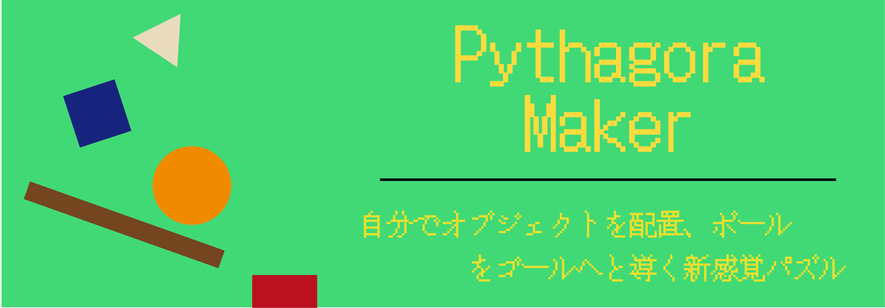

 

## アプリのURL

URLを記述

 

## アプリ概要

ボールをゴールであるスイッチまで運ぶパズルゲームです。 各ステージごとに用意されているオブジェクトを使用し、ゴールまでの道のりを自分で作りゴールまで導いてください。

 

## アプリを作ったきっかけ

「スクールのカリキュラム外の技術を使って、新しい技術を学びながらチーム開発を体験しよう！」というコンセプトから始まりました。 そこでフロント技術を中心としたアプリを作成することになり、ReactとMatter.jsをかけ合わせたゲーム「Pythagora Maker」を作ることになりました。

 

## アプリケーションのイメージ

※開発中の画面になります。

 

## 機能一覧
| トップ画面 |新規ユーザー登録画面 |
| ---- | ---- |
|  |  |
| ユーザー未登録の方が「Game Start」を押すとユーザー登録画面に遷移するように設定しています。 | すぐに遊んでいただけるようにシンプルな登録項目にしました。 |

| ログイン画面 |　デフォルトステージ画面 |
| ---- | ---- |
|  |  |
| supabaseを使用することで認証機能を実装しました。 | 初期設定のステージセレクト画面です。 難易度が異なる8つのステージを楽しむことができます。 |

| ユーザーステージ画面 |　ステージ編集画面 |
| ---- | ---- |
|  |  |
| ユーザーが作成したステージのみを表示する画面です。 ※画像は開発中のものになります。 | ユーザーが作成したステージを確認、編集する画面です。 最大3つまで作成することができ、その中から1つだけを公開することができます。 |

| ステージ作成画面 |　テストプレイ画面 |
| ---- | ---- |
|  |  |
| 実際にユーザー自身がステージを作成することができる画面です。 | ユーザー自身が作成したステージをテストできる画面です。 |

| プロフィール画面 |　 |
| ---- | ---- |
|  |  |
| ユーザーのプロフィールを確認、編集できる画面です。 クリアした |  |

 

## 使用技術

#### フロントエンド

#### データベース

#### ストレージサービス

#### インフラ

#### その他

 

## ER図

 

## 画面遷移図

https://www.figma.com/file/TJrwdvgpydCBUVdtDF0Ox0/%E3%83%94%E3%82%BF%E3%82%B4%E3%83%A9%E3%82%81%E3%81%84%E3%81%8B%EF%BD%9E?type=design&node-id=0-1&mode=design&t=FaRmC42fXabSyCa6-0

 

## 今後の展望

- 〇〇を追加
- 〇〇を導入
- etc...

## 各ディレクトリの説明
public/assets: 画像ファイルやロゴなどの静的ファイルを格納  
src/components: 共通コンポーネントを格納(ヘッダー、フッターなど)  
src/contexts: コンテキストを格納(ログイン情報など)  
src/hooks: カスタムフックを格納  
src/pages: 各ページの作業用ディレクトリ(実装者はこのディレクトリ配下にページごとにディレクトリを作成してください)  
src/services: 外部APIとの接続サービスを格納(Supabaseクライアントなど)
src/utils: 定数などを格納

## Supabaseコンテナの導入方法

開発環境の動作にはSupabaseコンテナの実行が必須です。  
以下の手順に従ってコンテナを立ち上げておいてください。

1. リポジトリをクローンする  
git clone --depth 1 https://github.com/supabase/supabase

2. docker-compose.ymlが存在するディレクトリに移動  
cd supabase/docker

3. 環境変数をコピー  
cp .env.example .env

4. 最新のイメージを取得する  
docker compose pull

5. コンテナをバックグラウンドで立ち上げる  
docker compose up -d

以上でローカルにsupabaseコンテナを構築することができます。  
supabaseのダッシュボードにアクセスする場合はhttp://localhost:8000/にアクセスしてください。  
以下にセルフホスト版のSupabaseのドキュメントのリンクを置いておきます。  
https://supabase.com/docs/guides/self-hosting/docker

## React-iconsの使い方 例:ai/AiFillAccountBook

1.使いたいアイコンを選びimport(https://react-icons.github.io/react-icons/を参照)
例:import { AiFillAccountBook } from "react-icons/ai";

2.アイコンを挿入したいところに下記のように記述(アイコン自体にtailwind.css使えません)
例:<AiFillAccountBook />